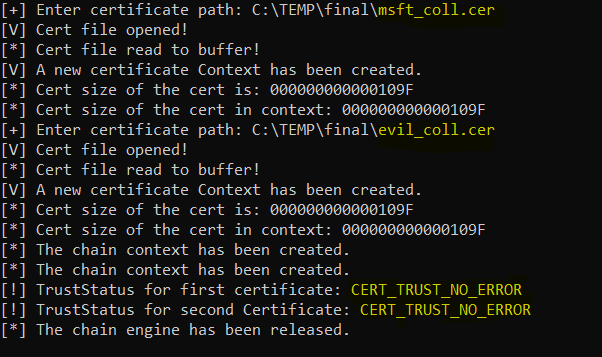

# CVE-2022-34689 - CryptoAPI spoofing vulnerability
This is the git repository for our research into CVE-2022-34689.

For more information about the vulnerability and its exploitation check out [our blog](https://www.akamai.com/blog/security-research/exploiting-critical-spoofing-vulnerability-microsoft-cryptoapi).

The repository contains code for two types of PoCs: one exploiting Chrome v48 and another focusing on the vulnerable MD5 check in crypt32.dll.
## Chrome v48 exploit
This code demonstrates the exploit on Chrome v48 (one that loads a vulnerable _crypt32.dll_, of course). It consists of two Python scripts and eventually spoofs Microsoft's identity.

Run it as follows:
```
Usage: mitm_script.py [path_to_modified_cert] [optional: interface_name] [optional: listening_address]
Example: sudo python3 mitm_script.py msft_coll.cer eth0 localhost
```

https://user-images.githubusercontent.com/114926055/214040642-beb765f7-4788-45e8-836c-a08dc441b5b4.mp4

## Local demo
The local demo is a program that takes a certificate and returns the trust status of its `chainContext`.
It can be used to demonstrate the vulnerable MD5 check in crypt32.dll.

To run this demo, compile the file `vulnerability_local_demo.cpp`. 
Run the executable, and when prompted, provide two certificates that md5-collide (we provide sample certificates in this repository).

The program will return the same trustStatus even though the first certificate is legitimate and the second isn't.

Result example:


