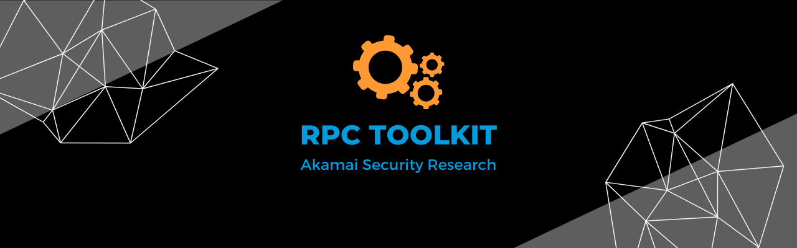

# RPC Toolkit

RPC Toolkit is a set of tools, articles, blog posts and links to help security researchers drive their RPC research.

During the last months, our team has put a lot of effort in learning MS-RPC, its internals, security and weaknesses. Along the way, we wrote some tools and automations to facilitate parts of the research process. We have shared our findings in blog posts, tweets and conference talks, and we'd like to make all these materials accessible through this repo.

We will also link to external tools and publications by other researchers, which we found useful in our learning process.  

For a writeup about the toolkit and its latest changes, please refer to this blogpost: [Fantastic RPC Interfaces and How to Find Them](https://www.akamai.com/blog/security-research/rpc-toolkit-fantastic-interfaces-how-to-find).  

## Tools

* [IDL scraper and parser](idl_scraper)
* [PE RPC scraper and parser](pe_rpc_if_scraper)
* [Rpc Visibility](rpc_visibility)
* [RPCView](https://www.rpcview.org/) (by Jean-Marie Borello, Julien Boutet, Jeremy Bouetard and Yoanne Girardin)
* [RPCEnum](https://github.com/xpn/RpcEnum) (by [@_xpn_](https://twitter.com/_xpn_))

## MS-RPC Background and Analysis
* [MS-RPC Security Measures - Flowchart](msrpc_security_flowchart.png)
  * [Original Whimsical](https://whimsical.com/rpc-security-M5EXms8zLnYFN8s6Lknh3q)
* [An Overview of MS-RPC and Its Security Mechanisms](https://www.akamai.com/blog/security-research/msrpc-security-mechanisms)
* [Give Me an E, Give Me a T, Give Me a W. What Do You Get? RPC!](https://www.akamai.com/blog/security-research/msrpc-defense-measures-in-windows-etw)
* [RPC Interface Inventory](rpc_interface_lists)
* [RPC ProtocolSequence int to string](rpc_protocol_sequence.txt)
* [A Definitive Guide to the Remote Procedure Call (RPC) Filter](https://www.akamai.com/blog/security/guide-rpc-filter)
* [Analyzing RPC With Ghidra and Neo4j](https://blog.xpnsec.com/analysing-rpc-with-ghidra-neo4j/) (by [@_xpn_](https://twitter.com/_xpn_))
* [Offensive Windows IPC Internals 2: RPC](https://csandker.io/2021/02/21/Offensive-Windows-IPC-2-RPC.html) (by [@csandker](https://twitter.com/0xcsandker))

## Vulnerabilities

* [CVE-2022-30216 - Authentication coercion of the Windows “Server” service](https://www.akamai.com/blog/security/authentication-coercion-windows-server-service)
* [Critical Remote Code Execution Vulnerabilities in Windows RPC Runtime](https://www.akamai.com/blog/security/critical-remote-code-execution-vulnerabilities-windows-rpc-runtime)
* [RPC Runtime, Take Two: Discovering a New Vulnerability](https://www.akamai.com/blog/security/rpc-runtime-patch-tuesday-take-two)
* [Cold Hard Cache: Caching Vulnerabilities in the _Server_ and _Workstation_ Services](https://www.akamai.com/blog/security-research/cold-hard-cache-bypassing-rpc-with-cache-abuse)
* [You’ve Crossed the Line — Disturbing a Host’s Rest (LSM Vulnerabilities)](https://www.akamai.com/blog/security-research/msrpc-lsm-cve-disturbing-hosts-rest)
* [Can't Wait to Shut You Down — Remote DoS Using Wininit.exe](https://www.akamai.com/blog/security-research/cant-wait-to-shut-you-down-msrpc-wininit)
* [LSM Vulnerability - Elevation of Privilege](https://twitter.com/nachoskrnl/status/1625882600777695232)
* [Exploring Three Remote Code Execution Vulnerabilities in RPC Runtime](https://www.akamai.com/blog/security-research/rpc-runtime-exploring-three-vulnerabilities)

## Exploitation Proof-of-Concept (PoC)

* [CVE-2022-30216](../PoCs/cve-2022-30216)
* [CVE-2022-38034](../PoCs/cve-2022-38034)
* [CVE-2022-37973](../PoCs/cve-2022-37973)
* [CVE-2022-37998](../PoCs/cve-2022-37998)
* [CVE-2022-44707](../PoCs/cve-2022-44707)
* [CVE-2023-21771](../PoCs/cve-2023-21771)

## Conferences Materials

* [DEF CON 30](https://defcon.org/html/defcon-30/dc-30-index.html) (Ben Barnea, Ophir Harpaz)
  * [Slides](../conferences_materials/DEF%20CON%2030/Exploring%20Ancient%20Ruins%20to%20Find%20Modern%20Bugs%20-%20Discovering%20a%200-Day%20in%20MS-RPC%20Service.pdf)
  * [Demo video](../conferences_materials/DEF%20CON%2030/CVE-2022-30216_RelayDemo.webm)
  * [Talk recording](https://www.youtube.com/watch?v=lDvNKHGPsJg)
* [Hexacon](https://www.hexacon.fr/) (Stiv Kupchik, Ophir Harpaz)
  * [Slides](../conferences_materials/Hexacon%202022/Exploring%20Ancient%20Ruins%20to%20Find%20New%20Bugs%20-%20Hexacon%202022.pdf)
  * [Demo video](../conferences_materials/Hexacon%202022/wkssvc_demo_for_hexacon.mp4)
  * [Talk recording](https://www.youtube.com/watch?v=rrfI6dXMJQQ)
* [BlackHat USA 2023](https://www.blackhat.com/us-23/) (Stiv Kupchik)
  * [Slides](../conferences_materials/BlackHat%20USA%202023/)
  * [Demo video](../conferences_materials/BlackHat%20USA%202023/rpc_visibility_demo.mp4)
    
-------
Copyright 2023 Akamai Technologies Inc.

Licensed under the Apache License, Version 2.0 (the "License");
you may not use this file except in compliance with the License.
You may obtain a copy of the License at

    http://www.apache.org/licenses/LICENSE-2.0

Unless required by applicable law or agreed to in writing, software
distributed under the License is distributed on an "AS IS" BASIS,
WITHOUT WARRANTIES OR CONDITIONS OF ANY KIND, either express or implied.
See the License for the specific language governing permissions and
limitations under the License.
