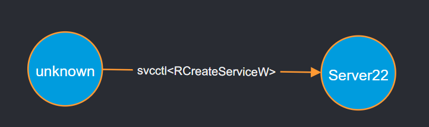
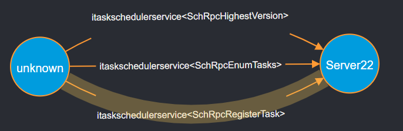
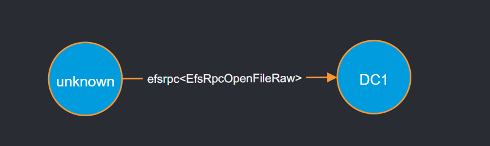

# RPC Visibility

RPC Visibility is a tool we developed to showcase how useful can insights into RPC operations can be.  
This tools subscribes to the RPC ETW provider and parses the events for RPC call starts to see which operations are being requested.  
It saves all the data to a database for querying. Currently, only Neo4j is supported, but the tool is built robustly to allow easy extensions.  
Below, you'll find sample queries for common lateral movement techniques that are RPC based.  
  
The tool also deals with various issues in the RPC ETW provider. For example, on the server side, the network address of the caller isn't saved.  
To deal with that, we also subscribe to the SMB and RPC providers, and match network connection events with the RPC events (via the RPC endpoint) to find the client's IP address.  

To run the tool, just provide the tool with the DBs address and credentials, and watch the events flow in.  

```python rpc_visibility.py --db_host bolt://192.168.0.1:7687 --username neo4j --password Aa1234567```

This tool and the research behind it were also presented at BlackHat USA 2023, you can find the slides [here](../../conferences_materials/BlackHat%20USA%202023/Lifting%20the%20Fog%20of%20War.pdf)

----------------
## Lateral movement queries
  
### PSExec
```
Match p=(s:Computer)-[r:Connects]->(d:Computer)
Where s.hostname <> d.hostname
AND r.interface_uuid = "367abb81-9844-35f1-ad32-98f038001003" AND r.opnum = 12
Return p
```



### DCSync
```
Match p=(s:Computer)-[r:Connects]->(d:Computer)
Where s.hostname <> d.hostname
AND r.interface_uuid = "e3514235-4b06-11d1-ab04-00c04fc2dcd2" AND r.opnum = 3
Return p
```
  


### Remote Task Scheduler
```
Match p=(s:Computer)-[r:Connects]->(d:Computer)
Where s.hostname <> d.hostname
AND r.interface_uuid = "86D35949-83C9-4044-B424-DB363231FD0C" AND r.opnum = 1
Return p
```
  


### PetitPotam
```
Match p=(s:Computer)-[r:Connects]->(d:Computer)
Where s.hostname <> d.hostname
AND r.interface_uuid = "c681d488-d850-11d0-8c52-00c04fd90f7e" AND (r.opnum = 0 OR r.opnum = 4)
Return p
```
  


### WMI
WMI is more complicated, since it relies on DCOM and not plain RPC.  
In our tests, it seems there's a difference in the functions called during a regular _get_ operation and a _call_ operation.  
This query utilizes that to hopefully detect only _call_ operations.  
```
MATCH p=(s:Computer)-[r:Connects]->(d:Computer)
WHERE s.hostname <> d.hostname
AND (r.interface_uuid = "9556dc99-828c-11cf-a37e-00aa003240c7" OR r.interface_name = "iwbemservices")
AND (r.opnum = 24 OR r.function_name = "ExecMethod")
AND NOT EXISTS{
    MATCH (s2:Computer)-[r2:Connects]->(d2:Computer)
    WHERE s2 = s AND d2 = d
    AND (
        (
            (r2.interface_uuid = "423ec01e-2e35-11d2-b604-00104b703efd" OR r2.interface_name = "iwbemwcosmartenum") 
            AND (r2.opnum = 3 or r2.function_name = "Next")
        )
        OR (
            (r2.interface_uuid = "1c1c45ee-4395-11d2-b60b-00104b703efd" OR r2.interface_name = "iwbemfetchsmartenum") 
            AND (r2.opnum = 3 or r2.function_name = "GetSmartEnum")
        )
    )
    AND (r.timestamp - duration({milliseconds: 15})) <=r2.timestamp <= (r.timestamp + duration({milliseconds: 15}))
}
RETURN p
```
  
